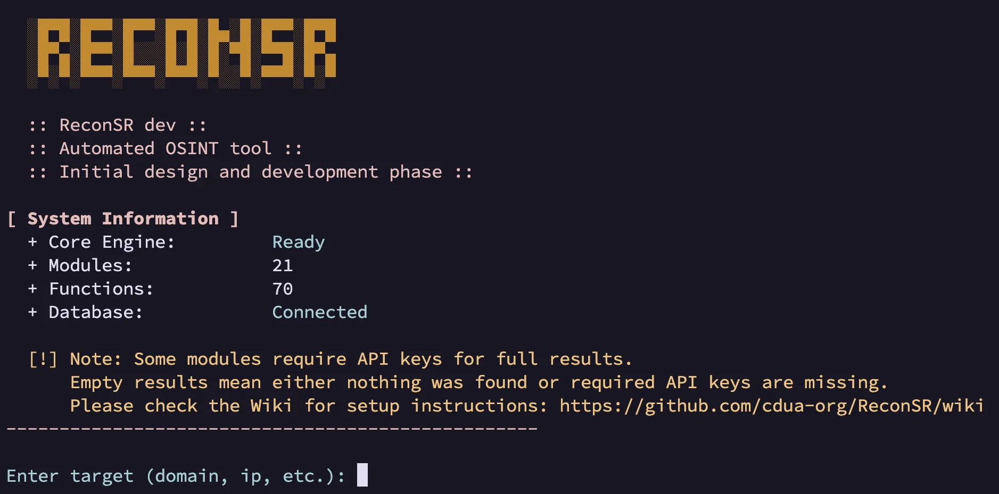
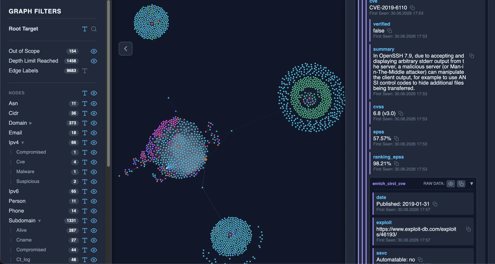

# ReconSR

```text
  ░█▀█░█▀▀░█▀▀░█▀█░█▄░█░█▀▀░█▀█
  ░█▀▄░█▀▀░█░░░█░█░█░▀█░▀▀█░█▀▄
  ░▀░▀░▀▀▀░▀▀▀░▀▀▀░▀░░▀░▀▀▀░▀░▀
```

[](https://github.com/cdua-org/ReconSR/actions/workflows/ci.yml)
[](https://github.com/cdua-org/ReconSR/releases)
[](https://github.com/cdua-org/ReconSR/commits/main)
[](https://github.com/cdua-org/ReconSR/issues)
[](https://github.com/cdua-org/ReconSR)
[](https://github.com/cdua-org/ReconSR/wiki)
[](LICENSE)

ReconSR is an automated OSINT tool designed to provide cybersecurity researchers with a modular framework for mapping and analyzing complex digital footprints and attack surfaces.

<table>
  <tr>
    <td width="50%">
      <a href=".github/images/ReconSR-cli.webp">
        
      </a>
    </td>
    <td width="50%">
      <a href=".github/images/ReconSR-html.webp">
        
      </a>
    </td>
  </tr>
</table>

> [!CAUTION]
> **Legal Disclaimer:** This tool is designed for authorized security auditing, infrastructure monitoring, and legitimate security research. ReconSR is provided "as is", without warranty of any kind. The authors are not liable for any direct or indirect damages, data loss, systemic failures, misuse, or legal consequences resulting from the use of this software. Users are solely responsible for ensuring that their activities comply with local and international laws. Scanning targets without prior explicit authorization is illegal and unethical.

> [!WARNING]
> **Third-Party Services & APIs:** ReconSR interacts with various external APIs, public registries, and third-party databases. Each of these providers operates under its own Terms of Service (ToS), Acceptable Use Policies (AUP), and data licensing agreements.
>
> By using ReconSR, you acknowledge that:
> 1. You are solely responsible for reviewing and strictly complying with the Terms of Service of any third-party data provider queried by this framework.
> 2. The authors of ReconSR hold no liability for any rate-limiting, IP banning, API termination, or legal actions resulting from your abusive, excessive, or non-compliant use of these external services.

> [!IMPORTANT]
> **Methodology:** Current modules focus on **Passive Intelligence Collection** (leveraging DoH, public registries, and third-party datasets) to provide a structured foundation for manual investigation. Automated **Data Analysis**, **Result Verification**, and **Active Reconnaissance** (direct probing, port scanning, and service-level interaction) are slated for subsequent development phases.

> [!WARNING]
> **Status:** Active Development.
> This project is currently in the initial design and development phase. APIs and core structures are subject to significant changes as we refine the reconnaissance logic.

## System Architecture

ReconSR moves beyond traditional flat-list enumeration by implementing a reactive, event-driven pipeline that recursively transforms discoveries into new investigative targets.

<details><summary>View detailed architecture</summary>

### 1. Reactive Execution Pipeline (`internal/pipeline`)
The core of ReconSR is a non-blocking reactive loop. The data flows in a cycle: **Dispatcher → Modules → Processor → Repository → Dispatcher**, continuing until no new entities remain.

- **Controller** (`internal/controller`): Serves as the integration boundary (Facade) between external presentation layers (currently the CLI) and the core engine. By strictly isolating user interaction from the core, it enables the future addition of diverse interfaces—such as Web GUIs, REST APIs, or automated bots—without altering the underlying system architecture. Operationally, it orchestrates the initial input flow by delegating target verification to the Validator and Scope Manager before initializing the reconnaissance cycle with validated seed entities.
- **Dispatcher** (`internal/dispatcher`): Routes entities to modules based on a type-indexed registry (`domain` → DNS, WHOIS, etc.). Tracks completed functions per entity to prevent redundant execution. Enforces a configurable global timeout per module call.
- **Processor** (`internal/processor`): Validates module output against the contract (rejects rogue functions, incomplete data, syntax errors). Normalizes entity types via the Validator and checks scope boundaries via the Scope Manager.
- **Repository** (`internal/repository`): A centralized data access layer. All database operations are strictly isolated here (Repository pattern) to ensure the core remains database-agnostic, facilitating seamless future migrations from the current per-project SQLite setup to enterprise RDBMS (e.g., PostgreSQL). Handles persistence, entity deduplication, and dispatch batching.

### 2. Supporting Infrastructure
- **Scope Manager** (`internal/scopemanager`): The operational firewall. Applies strict reconnaissance boundaries configured by the user in `configs/scope.txt` via allow/block rules (supporting domain suffix matching, IP CIDR ranges, and exact entity matches). Operating within these technical parameters facilitates adherence to authorized Rules of Engagement (legal compliance) and helps mitigate "scope explosion" (infinite recursive crawling into third-party infrastructure).
- **Validator** (`internal/validator`): Centralized entity type normalization and syntax validation. Automatically classifies domains vs. subdomains, IPv4 vs. IPv6, and standard vs. extra emails (those containing non-standard characters like quotes or brackets).
- **Report Renderer** (`internal/report`): Recursive ASCII tree visualization of the project relationship graph with scope-awareness (Out-of-Scope markers, cycle detection).
- **Interactive Visualizer** (`internal/html`): Generates a dynamic, draggable HTML representation of the entity relationship graph. Features interactive layouts and togglable node labels to facilitate visual analysis of complex attack surfaces.

### 3. External Intelligence & API Strategy
ReconSR combines zero-configuration public sources with user-configured API integrations:
- **Keyless Integration**: Public-source modules can operate without user accounts or API keys, subject to provider limits and availability.
- **User API Keys**: API-backed modules expose their functions only when the corresponding user-provided key is configured locally. Some integrations may also support optional keys while preserving keyless operation.
- **Demo Mode**: Supported key-based modules can be explicitly switched to bundled sample data by configuring their service key as `demo-api-key`. This lets users explore module output volume and data structure before deciding whether to obtain real provider credentials, without querying third-party APIs.
- **Rate Limiting & ToS Awareness**: Both keyless and authenticated providers enforce their own quotas, rate limits, Terms of Service, and data licensing rules. Users are responsible for obtaining credentials where required and complying with each provider's policies.
- **Module Interface**: The system follows a strict **"Black Box" contract**. Developers can extend ReconSR capabilities without needing to understand the internal core logic, routing, or database structures.
</details>

---

## Shared Module Utilities (`modules/utils`)

`modules/utils` contains reusable building blocks shared across intelligence modules. These packages are not dispatcher modules and do not expose reconnaissance functions directly; they centralize common concerns such as API key loading, shared constants, DNS record parsing, HTTP retry/status handling, module execution helpers, resolver/runtime settings, etc.

## Intelligence Modules (`modules/`)

> [!TIP]
> **Documentation:** Detailed information about each module, including configuration, expected inputs, and functional behavior, is available in the [ReconSR Wiki](https://github.com/cdua-org/ReconSR/wiki).
>
> **For Developers:** Detailed specifications for building new reconnaissance plugins can be found in the [MODULE_GUIDE.md](./MODULE_GUIDE.md).

> [!NOTE]
> **API-backed modules and demo mode:** Modules that require personal API credentials expose their functions only when the corresponding key is configured. Users must obtain API keys independently from the relevant third-party services and configure them locally in `configs/keys.txt`. If a key is absent, those functions are not advertised to the dispatcher and are not scheduled for execution. Demo mode must be enabled explicitly by setting the corresponding service key to `demo-api-key`. In demo mode, supported modules return bundled sample data instead of querying the external API.
>
> **Local database modules:** Modules backed by offline databases expose their functions only when the required database files are installed locally. Users must obtain those databases independently from the relevant providers and place them in the expected local data directory. If the required files are absent, the related functions are not advertised to the dispatcher and are not scheduled for execution.

### 1. Subdomain Hierarchy (`modules/subdomain_hierarchy`)
<details><summary>View details (1 function)</summary>

- `decompose`: Hierarchical decomposition of deep subdomains. Extracts the organizational domain (eTLD+1 via the Public Suffix List) and all intermediate parent subdomains, using the `Applied` flag to prevent redundant re-processing.
</details>

### 2. Advanced DNS Discovery (`modules/dns`)
<details><summary>View details (27 functions)</summary>

A highly specialized intelligence module for comprehensive DNS reconnaissance. Every record type is treated as a critical intelligence vector (27 functions total):

#### **Infrastructure & Continuity**
- `preflight_dns`: Lightweight zone health validation that tags resolvable targets with `dns_ok` and flags broken zones before higher-cost enumeration begins.
- `get_ip`: IPv4/IPv6 resolution (A/AAAA).
- `get_ns`: Identification of authoritative name servers with validation and scope analysis.
- `get_mx`: Mail exchange discovery with priority sorting plus extraction of validated `mx_host` infrastructure nodes.
- `get_soa`: Extracts the raw SOA record, the Serial value, the validated Primary NS (MNAME), and the validated Responsible Email (RNAME).
- `get_cname`: Mapping of canonical aliases for the target and `www.` prefix, differentiating in-scope aliases from external `cname_target` infrastructure.
- `check_wildcard`: Proactive detection via random subdomain probing.

#### **Identity & Trust Policy**
- `get_caa`: Extracts authorized CAs as typed infrastructure nodes and surfaces validated `iodef` violation-reporting mailboxes.
- `get_dmarc`: Retrieves the DMARC policy and extracts failure (`ruf`) and aggregate (`rua`) emails; detects external reporting (OOS).
- `get_dkim`: Retrieves full DKIM records via brute-force of 33 common and 2 dynamic selectors.
- `get_domainkey`: Extraction of legacy cryptographic records.
- `get_txt`: Retrieval of full SPF records alongside general TXT data aggregation.

#### **Cryptographic Keys & Protocols**
- `get_dnskey`: Extraction and categorization of KSK and ZSK signing keys.
- `get_ds`: Mapping of Delegation Signer digests (SHA-1/256/384).
- `get_cert`: Extraction of raw certificate payloads (PKIX, PGP, SPKI).
- `get_sshfp`: Verification of SSH public key fingerprints for diverse algorithms.
- `get_hip`: Decodes Host Identity Protocol parameters, including HIT/public keys and validated HIP rendezvous servers.
- `get_ipseckey`: Unmasks VPN gateway topology (IPs/domains) and associated public keys with validated gateway classification.

#### **Service & Metadata Discovery**
- `get_srv`: Brute-forcing of 33 service prefixes (SIP, XMPP, LDAP, Kerberos, CalDAV, Matrix, etc.).
- `get_tlsa`: DANE certificate fingerprinting with brute-force of 7 port-protocol prefixes (`_443._tcp`, `_25._tcp`, `_465._tcp`, `_587._tcp`, `_993._tcp`, `_853._tcp`, `_443._udp`).
- `get_svcb`: Parallel decoding of both SVCB (type 64) and HTTPS (type 65) parameters including ALPN, ECH, IP hints, and port.
- `get_naptr`: Extraction of service identifiers and validated replacement targets, including `_service._proto.domain` delegation patterns.
- `get_uri`: Native URI resolution for mapped applications (priority/weight mapping).
- `get_loc`: Precise decoding of physical coordinates (Lat/Lon/Alt/Size/Precision).
- `get_hinfo`: Disclosure of CPU/OS metadata with automated noise filtering.
- `get_rp`: Extraction of the Responsible Person mailbox and TXT reference domains as linked nodes.
- `get_nsec`: Proactive zone-walking via NXDOMAIN triggers to uncover hidden subdomains and record coverage hints.
</details>

### 3. Mail Identity Crypto (`modules/mailcrypto`)
<details><summary>View details (3 functions)</summary>

Specialized discovery of cryptographic communication keys linked to organizational identities:
- **Hashing Architecture**: Implementation of RFC 7929/8162 (SHA256/Base32) for deterministic lookup hashing.
- **Dual-Input Logic**:
    - **Email Address**: Targeted, direct cryptographic key lookup for the specified local part.
    - **Domain/Subdomain**: Optional brute-force of 15 administrative aliases (`admin`, `support`, `noc`, `security`, `abuse`, etc.); disabled by default via network options and available for explicit opt-in.
- `preflight_dns`: Zone health validation for the target email domain before cryptographic lookups are performed.
- `get_openpgpkey`: Discovery of PGP public keys via OPENPGPKEY DNS records.
- `get_smimea`: Extraction of S/MIME certificate parameters with DANE mapping.
</details>

### 4. WHOIS/RDAP (`modules/whois`)
<details><summary>View details (1 function)</summary>

- `get_whois`: Fallback-oriented architecture using RDAP as primary and TCP 43 as secondary. Features recursive registry discovery starting from `whois.iana.org` and registry-specific query handling (JPRS, Verisign, DENIC, NIC.name), models registrar/registrant hierarchies through anchor nodes, and extracts role-aware contacts, addresses, dates, name servers, domain status, DNSSEC state, and registrar metadata such as registrar URL, WHOIS server, and IANA ID.
</details>

### 5. Hunter.io Email Intelligence (`modules/hunterio`)
<details><summary>View details (1 function)</summary>

- `get_hunterio_domain_search`: Queries Hunter.io Domain Search for domains, and optionally organizations, when an API key is configured. Extracts discovered email addresses, confidence and verification status, email pattern, organization metadata, linked domains, person names, roles, departments, seniority, phone numbers, social profiles, source URLs/domains, source dates, and provider flags such as disposable, webmail, accept-all, etc., with API preflight, credit tracking, pagination, retry handling, and explicit demo-mode support.
</details>

### 6. HaveIBeenPwned Data Breaches (`modules/haveibeenpwned`)
<details><summary>View details (1 function)</summary>

- `get_email_breaches`: Queries the HaveIBeenPwned API for compromised email accounts. Extracts breach metadata including description, leaked data classes, pwned records count, dates, related domain, etc. Evaluates risk indicators (malware, stealer logs, etc.), with explicit demo-mode support.
</details>

### 7. Certificate Transparency (`modules/domainsbycerts`)
<details><summary>View details (1 function)</summary>

- `get_domains`: Passive certificate-identity harvesting through configurable Certificate Transparency sources, including `crt.sh`, direct PostgreSQL access to `crt.sh`, and `CertSpotter`. Discovers subdomains, wildcard subdomains, and certificate-bound email identities, attaches expiration metadata to both hostname and email identities, emits explicit `expired` status where applicable, and summarizes subdomains with expired certificates separately for triage.
</details>

### 8. HackerTarget Passive DNS (`modules/hackertarget`)
<details><summary>View details (1 function)</summary>

- `get_hosts`: Queries the `HackerTarget` passive DNS dataset to identify validated domain and subdomain nodes and their directly linked resolved IP nodes. Supports an optional API key; without one, requests use the public keyless endpoint and remain subject to IP-based service limits. Includes automatic retry logic, API quota detection, and out-of-scope classification.
</details>

### 9. Anubis DB (`modules/anubis`)
<details><summary>View details (1 function)</summary>

- `get_domains`: Passive subdomain enumeration through the `anubisdb.com` Anubis database. Returns validated subdomains and wildcard subdomains, deduplicates results, and filters ARPA/out-of-scope noise before graph insertion.
</details>

### 10. IPv4 Deobfuscation (`modules/ipv4ambiguous`)
<details><summary>View details (1 function)</summary>

- `parse_ambiguous`: Resolution of ambiguous IPv4 addresses containing leading zeros. Decodes input (e.g., `012.012.012.012`) into both strict decimal (`12.12.12.12`) and POSIX-compliant octal (`10.10.10.10`) formats to identify obfuscation and misconfigurations.
</details>

### 11. IP Intelligence (`modules/ip_metadata`)
<details><summary>View details (6 functions)</summary>

Passive reconnaissance of IPv4/IPv6 addresses via reverse DNS, public blacklists, and RIPEstat data endpoints to uncover network identity and reputation:
- `get_ptr`: Performs reverse DNS lookups to resolve IPs back to their mapped domains.
- `get_asn`: Resolves the originating Autonomous System Number (ASN) and BGP prefix via Team Cymru DNS TXT queries.
- `get_tor`: Detects if the IP is an active Tor exit node using official DNSBL checks (`dnsel.torproject.org`, `dan.me.uk`).
- `get_rbl`: Checks the IP against major Real-time Blackhole Lists (Spamhaus, Barracuda, Spamcop) to identify spam/botnet reputation.
- `get_ip_info`: Extracts the network name (`netname`) and description from RIPE WHOIS records.
- `get_ip_abuse_contacts`: Retrieves dedicated abuse reporting email addresses registered to the specific IP allocation.
</details>

### 12. IPinfo Intelligence (`modules/ipinfo`)
<details><summary>View details (1 function)</summary>

- `get_ip_info`: Queries the IPinfo API for IPv4/IPv6 targets when an API key is configured. Extracts Geo, ASN, Privacy, Mobile, Hosting, Anycast, Satellite, Reverse IP metadata, etc. Depending on the configuration, it queries either the rich lookup endpoint or defaults to the free lite endpoint. Includes explicit demo-mode support.
</details>

### 13. AbuseIPDB Reputation (`modules/abuseipdb`)
<details><summary>View details (1 function)</summary>

- `check_abuseipdb`: Queries AbuseIPDB for IPv4/IPv6 reputation when an API key is configured. Extracts abuse confidence score, report count, report summaries, network metadata (country, ISP, usage type, etc.), risk indicators (malicious, suspicious, whitelisted, Tor exit, etc.), category-derived threat tags, and reverse-IP hostnames/domains, with retry, daily quota detection, and explicit demo-mode support.
</details>

### 14. IP2Location Local Intelligence (`modules/ip2location`)
<details><summary>View details (3 functions)</summary>

Offline IPv4/IPv6 enrichment backed by locally installed IP2Location/IP2Proxy BIN databases under `data/ip2location`:
- `get_geo_ip`: Extracts geolocation, ISP, reverse-IP domain, usage type, mobile network metadata, connection speed, address type, IAB category, etc. from DB11 Geo IP data.
- `get_ip_asn`: Resolves ASN, AS owner, linked AS domain, AS usage type, and AS CIDR from IP2Location ASN data.
- `get_proxy_check`: Detects proxy/VPN/Tor/datacenter/residential/privacy-network indicators through IP2Proxy data, extracting fraud score, last-seen age, provider, reverse-IP domain, usage type, and threat-derived tags such as scanner, spam, botnet, etc.
</details>

### 15. MaxMind Local Intelligence (`modules/maxmind`)
<details><summary>View details (4 functions)</summary>

Offline IPv4/IPv6 enrichment backed by locally installed MaxMind MMDB databases under `data/maxmind`:
- `get_geo_ip`: Extracts comprehensive geolocation metadata (city, region, country, coordinates, timezone, etc.) from City databases.
- `get_ip_asn`: Resolves Autonomous System Number (ASN), associated organization, ISP, etc. from ASN and ISP databases.
- `get_proxy_check`: Identifies anonymous IPs, VPNs, Tor exit nodes, etc. from Anonymous IP databases, emitting standardized threat tags.
- `get_mm_enterprise_data`: Provides maximum data density by aggressively parsing Enterprise databases. Combines all available geo, ASN, ISP, connection type, user type, etc. into a single unified output.
</details>

### 16. ASN Intelligence (`modules/asn_metadata`)
<details><summary>View details (4 functions)</summary>

Deep analysis of Autonomous System Numbers via RIPEstat API to map network hierarchies, ownership, and announced subnets:
- `get_asn_peers`: Constructs a strict linear transit chain by identifying the largest upstream provider at each hop, revealing who the ASN buys transit from.
- `get_asn_prefixes`: Retrieves all IPv4/IPv6 CIDR blocks (BGP prefixes) currently announced by the ASN.
- `get_asn_info`: Resolves the official legal holder (organization name) of the Autonomous System.
- `get_asn_abuse_contacts`: Extracts abuse reporting email addresses associated with the ASN infrastructure.
</details>

### 17. Shodan Intelligence (`modules/shodan`)
<details><summary>View details (3 conditional functions)</summary>

Shodan enrichment uses two capability modes: without an API key, only the public InternetDB function is advertised with reduced host exposure data; when a Shodan API key is configured, InternetDB is replaced by API-backed IP and domain functions with richer results and explicit demo-mode support:
- `get_idb_shodan`: Passive enrichment of IPv4/IPv6 targets through the public Shodan InternetDB endpoint. Extracts PTR hostnames, open ports, service tags, known CVEs, and CPE fingerprints for rapid exposure triage.
- `get_shodan_api_ip`: Queries the Shodan Host API for IPv4/IPv6 targets. Extracts reverse-IP domains, ASN, organization, ISP, OS, hostnames, tags, last update, service banners, ports, CVEs, CPEs, SSL/TLS metadata, etc.
- `get_shodan_api_domain`: Queries the Shodan DNS Domain API for domains, and optionally subdomains. Extracts passive DNS subdomains and a broad set of DNS-derived entities that can overlap with multiple dedicated DNS modules, including record values, last-seen dates, wildcard markers, historical tags, out-of-scope classifications, etc.
</details>

### 18. VirusTotal Intelligence (`modules/virustotal`)
<details><summary>View details (2 functions)</summary>

API-backed enrichment for domains, optionally subdomains, and IPv4/IPv6 targets through VirusTotal API v3. Without a VirusTotal API key, no functions are advertised to the dispatcher; with a configured key, the module exposes both functions and supports explicit demo mode:
- `get_virustotal_domain`: Queries VirusTotal domain metadata and, when enabled, related subdomains. Extracts tags, reputation and threat scores, categories, popularity ranks, JARM, crowdsourced context, certificate identities and fingerprints, DNS-derived entities, expired-certificate subdomain summaries, out-of-scope classifications, etc.
- `get_virustotal_ip`: Queries VirusTotal IP metadata and passive DNS resolutions. Extracts ASN, network CIDR, AS owner, geo metadata, JARM, tags, threat scores, last update, passive DNS hostnames, etc.
</details>

### 19. Vulnerability Lookup (`modules/vuln_lookup`)
<details><summary>View details (2 functions)</summary>

- `enrich_circl_cve`: Queries the CIRCL Vulnerability API for CVE entities. Supports an optional API key; without one, requests use the public keyless endpoint and remain subject to strict rate limits. Extracts vulnerability summaries, CWE classifications with local descriptions, best available CVSS metrics, affected CPE criteria, EPSS probability and percentile, SSVC/KEV indicators, additional metadata included in CIRCL responses, etc.
- `search_circl_cpe`: Queries the CIRCL Vulnerability API for CPE entities. Searches for products by name and extracts associated CVEs, vendor details, and related metadata.
</details>

### 20. LeakIX Intelligence (`modules/leakix`)
<details><summary>View details (3 functions)</summary>

API-backed exposure and data leak intelligence for domains and IPv4/IPv6 targets through the LeakIX API. Without a LeakIX API key, no functions are advertised to the dispatcher; with a configured key, the module exposes all three functions and supports explicit demo mode:
- `get_leakix_domain`: Queries LeakIX domain intelligence. Extracts discovered services grouped by IP/port/protocol, open ports, protocols, software versions, web server headers, favicon hashes, SSL/TLS metadata (JARM, certificate fingerprints, SAN domains, issuer, expiration), SSH properties, leaked credentials, leak severity/type/stage, dataset statistics, network context (ASN, organization, CIDR), geolocation, reverse DNS, MAC addresses, tags, event sources, and leak summaries, with retry, rate-limit handling, and blocked-key detection.
- `get_leakix_ip`: Queries LeakIX host intelligence for IPv4/IPv6 targets. Extracts the same comprehensive service, leak, credential, network, and SSL/SSH metadata as the domain function, organized around per-host event groups.
- `get_leakix_subdomains`: Queries LeakIX passive subdomain enumeration for domains. Extracts validated subdomains with last-seen dates, distinct IP counts, out-of-scope classification, and passive DNS tags.
</details>

### 21. Netlas Intelligence (`modules/netlas`)
<details><summary>View details (4 functions)</summary>

API-backed intelligence module for domains and IPv4 targets using the Netlas Host and Download APIs. Without a Netlas API key, no functions are advertised to the dispatcher; with a configured key, the module exposes its functions and supports explicit demo mode. *Note: The module can extract a wide range of data, from basic information to premium intelligence (such as Anonymity Labels, CVEs, exploit links, Threat Intelligence Data, etc.), depending on your Netlas pricing plan (from Free Tier up to Corporate).*
- `get_netlas_domain`: Enriches a domain (and optionally subdomains, depending on configuration). Returns aggregated data from across Netlas collections in a single response. Extracts IP addresses, ports, software, DNS records, WHOIS data, associated tags, CVEs, exploit links, etc.
- `get_netlas_ip`: Enriches an IPv4 address. Returns aggregated data from across Netlas collections in a single response. Extracts ports, software, WHOIS data, ASN information, geolocation, Anonymity Labels, reverse IP domains, CVEs, exploit links, Threat Intelligence Data, etc.
- `get_netlas_domains_by_ip`: Performs bulk retrieval of domains hosted on a specific IPv4 address (Reverse IP) using the Netlas download API. Along with the domains, it extracts their resolved IPs and associated DNS records ("a", "aaaa", "ns", "mx", "txt", "cname"). Requires `NetlasLimitPerOneDownload` to be configured > 0.
- `get_netlas_domains_by_domain`: Performs bulk retrieval of related domains (Passive DNS) for a given domain using the Netlas download API. Along with the domains, it extracts their resolved IPs and associated DNS records ("a", "aaaa", "ns", "mx", "txt", "cname"). Requires `NetlasLimitPerOneDownload` to be configured > 0.
</details>

---

## Security by Design

While ReconSR currently operates as a local CLI tool, its architecture is built with enterprise-grade security primitives to ensure a safe transition to future multi-tenant SaaS or Web environments:

*   **Zero Trust Module Execution:** The core engine inherently distrusts external modules. The `Processor` strictly enforces the "Black Box" contract, validating not only the syntax of incoming intelligence but also verifying that modules only return data for explicitly requested functions. Rogue or hijacked modules attempting to inject unsolicited data are automatically rejected.
*   **Strict Input Sanitization:** All entities (whether user-supplied or module-discovered) undergo rigorous syntax validation against expected types (e.g., IPv4, domain) before storage. Data is persisted as strict strings, structurally preventing injection attacks.
*   **Component Isolation & Least Privilege:** Internal components interact only through strictly defined boundaries. Modules communicate exclusively with the `Dispatcher` and have zero awareness of the database, other modules, or the user interface.
*   **Opaque Project Identifiers:** The `Repository` abstracts physical storage by generating temporary, ephemeral project identifiers during runtime. No core component other than the `Repository` has access to the true project IDs. This indirect referencing prevents data leakage and mitigates IDOR (Insecure Direct Object Reference) vulnerabilities in future multi-user deployments.

## Vision & Scalability

ReconSR is designed as a decoupled framework for Attack Surface Discovery and Mapping. Our long-term goal is to evolve the project from a standalone CLI tool into a comprehensive Attack Surface Management (ASM) intelligence platform. By strictly separating the execution engine, data storage, and external modules, the architecture mitigates technical debt and ensures the system can grow organically to meet enterprise demands.

*   **Ecosystem Extensibility:** The "Black Box" module contract allows the open-source community or internal security teams to develop and integrate proprietary reconnaissance plugins independently. This modularity fosters an ecosystem where ReconSR can rapidly adapt to new reconnaissance techniques and exposure patterns without requiring modifications to the core engine.
*   **Decoupled Interfaces:** Currently, the platform operates via a CLI. While we plan to develop RESTful APIs and Web GUIs, the `Controller`'s strict isolation of user interaction from the core reconnaissance pipeline (Facade pattern) also empowers developers to build custom interfaces—such as corporate ChatOps bots or proprietary dashboard integrations—leaving the underlying core logic untouched.
*   **Database Portability:** All data operations are centralized behind the `Repository` abstraction. While the current implementation uses a portable, per-project SQLite database, migrating to a distributed RDBMS (e.g., PostgreSQL) to support massive datasets only requires implementing a new database driver for the repository interface, rather than refactoring the application structure.
*   **Localization-Ready Architecture:** Interface text is fully decoupled from the core business logic. This separation ensures that future localization can be implemented strictly at the configuration level, without modifying the underlying engine.

### Future Goals

While the current alpha release is focused on automating point-in-time investigations, our long-term vision includes expanding the platform's operational capabilities:

*   **Collaborative Workspaces:** We aim to implement multi-user environments where distributed security teams can work simultaneously on complex investigations, sharing real-time insights and graph visualizations within a unified project scope.
*   **Continuous Monitoring:** We plan to extend ReconSR's capabilities to include continuous infrastructure monitoring, running alongside traditional single-run reconnaissance. Future features will focus on scheduled scanning, state comparisons, and alerting teams to unintended public exposures (e.g., forgotten subdomains, exposed sensitive data) or infrastructure changes. This paves the way for potential on-premise enterprise deployments or managed SaaS offerings.
*   **AI-Assisted Analysis:** To enhance the efficiency of investigations, we plan to enable the use of AI for analyzing large intelligence datasets, uncovering hidden threats, mapping non-obvious attack vectors, and interpreting complex infrastructure relationships.

---

## Project Roadmap

### Completed
<details><summary>View completed milestones</summary>

- ✅ Reactive pipeline architecture (Controller → Dispatcher → Processor → Repository).
- ✅ Scope Manager and entity type Validator.
- ✅ Subdomain hierarchy decomposition.
- ✅ CLI module configuration and ASCII/HTML report renderers.
- ✅ DNS reconnaissance: 27 functions covering infrastructure, identity, cryptography, DNSSEC, service discovery, and DNS health preflight checks.
- ✅ RFC 3597 wire-format decoder for DoH binary responses.
- ✅ WHOIS/RDAP with multi-registry support, structured registrar/registrant graph anchors, and registrar metadata extraction.
- ✅ Certificate Transparency harvesting via configurable CT sources, including `crt.sh`, direct PostgreSQL access to `crt.sh`, and `CertSpotter`, with wildcard identities, certificate-bound email identities, expiration metadata, and summaries of subdomains with expired certificates.
- ✅ Passive DNS enumeration via HackerTarget with validated domain/subdomain-to-IP relationships and optional API-key support.
- ✅ Hunter.io email intelligence with domain/organization search, contact enrichment, source evidence, and explicit demo mode.
- ✅ HaveIBeenPwned data breach intelligence for email targets, extracting compromised data classes, threat tags, metadata, and demo mode.
- ✅ Mail security: OPENPGPKEY and SMIMEA discovery with optional administrative alias enumeration and DNS preflight health checks.
- ✅ IPv4 ambiguity resolution (Decimal vs. POSIX octal decoding).
- ✅ Passive exposure enrichment via Shodan InternetDB and API-backed Shodan Host/DNS intelligence with demo mode.
- ✅ Netlas intelligence module for domains and IPv4 targets, supporting reverse IP and passive DNS queries with demo mode.
- ✅ Passive subdomain discovery via Anubis DB.
- ✅ IP intelligence: PTR, DNSBL (Tor/Spam), RIPE WHOIS metadata (netname, description), and abuse contacts.
- ✅ IPinfo API enrichment for IPv4/IPv6 targets, extracting Geo, ASN, Privacy, Mobile, Hosting properties, etc., with Lite/Paid endpoint toggle and demo mode.
- ✅ AbuseIPDB reputation checks with abuse scores, report summaries, threat tags, reverse-IP context, and demo mode.
- ✅ Offline IP2Location/IP2Proxy enrichment for geolocation, ASN, proxy/VPN/Tor indicators, and related IP metadata.
- ✅ Offline MaxMind enrichment via locally installed MMDB databases for geolocation, ASN, proxy/VPN indicators, and comprehensive Enterprise data aggregation.
- ✅ ASN intelligence: Transit peers hierarchy, BGP prefixes (CIDR), legal holder, and abuse contacts via RIPEstat.
- ✅ VirusTotal API enrichment for domain/IP reputation, passive DNS, certificate, DNS-derived, and threat-intelligence findings with demo mode.
- ✅ CIRCL vulnerability lookup for CVE enrichment and CPE search with CVSS, CWE, EPSS, SSVC/KEV, CPE, and related vulnerability metadata.
- ✅ LeakIX exposure and data leak intelligence for domains and IPs, including service discovery, leaked credentials, SSL/SSH metadata, subdomain enumeration, and demo mode.
</details>

### Upcoming
- Local web server.
- Additional API-backed passive intelligence modules.
- Active reconnaissance capabilities.

---

## Authors & License

ReconSR is an independent project developed by cybersecurity researchers from the non-profit expert community [Cyber Defense Unbiased Analysis (CDUA)](https://cdua.org).

**License:** ReconSR is distributed under the **PolyForm Noncommercial License 1.0.0**. All intellectual property and core development rights belong strictly to the individual authors: **roolsec** and **underhax**.

As we continue to evolve the framework, we are open to dialogue regarding enterprise integrations, partnerships, and commercial applications. For business inquiries, collaboration, or custom licensing discussions, please reach out to the development team:

* **roolsec:** roolsec [at] cdua [dot] org
* **underhax:** underhax [at] cdua [dot] org
